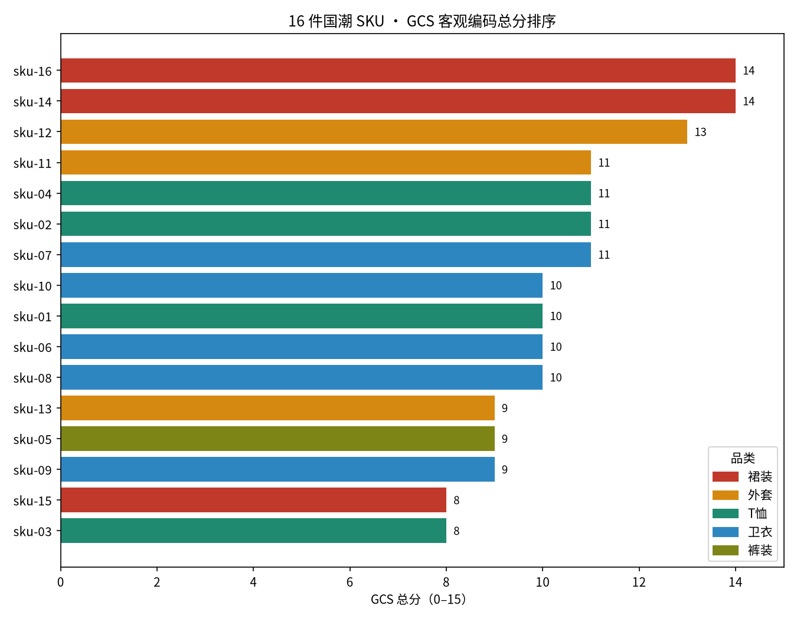
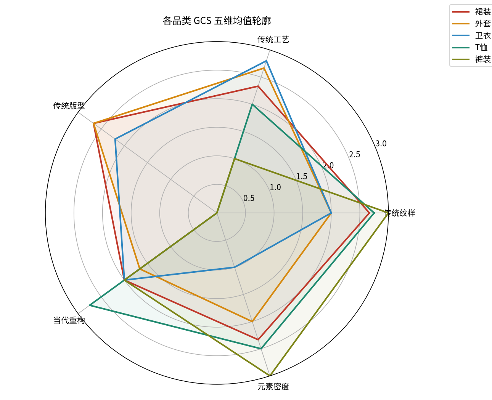

# No-Survey Lab · 问卷替代实验室

**你的研究生科研助手：搭概念模型、设计带来源的问卷、用公开数据替代问卷、跑通 SPSS → SmartPLS 分析路径。**
A research assistant that helps you build the conceptual model, design questionnaires with **cited, mature scales**, replace surveys with public data & digital traces, and follow a focused SPSS → SmartPLS analysis path.

[](LICENSE)
[](LICENSE-DOCS.md)
[](CHANGELOG.md)

---

### ▶ 在线试用（浏览器直接运行，无需安装、无需注册）

**<https://zhanglingshare.github.io/nosurvey-lab/>**

一个文件、零后端、**断网可跑、数据不出你电脑**。把研究假设粘进去（或读 `.docx`、上传概念图 OCR），五步走完即可得到一份完整研究方案。

**🎞 自动演示（打开即自动演完全程，无需点击、可循环）：<https://zhanglingshare.github.io/nosurvey-lab/demo.html>**

---

## 它帮你做四件事

面向写课程论文、期刊论文、毕业论文的研究生：

1. **搭概念模型** —— 从一段假设文字/一张概念图自动提取构念与关系，推断每个构念的**角色（自变量 / 中介 / 因变量 / 调节 / 控制）**；可手动添加、删除、改名、翻转方向，并在**可拖拽的网络图**里直接调整布局。
2. **设计带来源的问卷** —— 每个构念匹配**成熟量表**，标注量表名、**开发者与年份、出处期刊**、题项与计分；匹配不到的明确提示去检索原始量表或自编并做信效度，**杜绝无出处题项**。
3. **用公开数据替代问卷** —— 基于 **SRG 问卷替代度**判断“这个构念到底要不要发问卷”，能用行政/统计/交易数据、数字足迹、文本语料替代的，给出可复现的取数路线。
4. **明确分析路径（不贪多）** —— 描述统计与信度走 **SPSS**，测量模型与结构模型聚焦 **SmartPLS（PLS-SEM）**。

> 核心立场：问卷最大的浪费，是把**客观可观察的事实也拿去让人自报**。问卷不应是数据来源的默认项，而应是**效度兜底项**。

## 五步工作流

| 步骤 | 你做什么 | 产出 |
|---|---|---|
| 1 输入 | 粘贴假设，或读取 `.docx/.txt/.md`、上传概念图 OCR | 结构化原始文本 |
| 2 拆解 | 核对构念、角色、测量类型与关系方向（可增删改），勾选确认 | 概念模型 |
| 3 问卷设计 | 查看每个构念的成熟量表、来源、题项与计分 | 带来源问卷 |
| 4 新方法替代 | 查看 SRG 分级与公开数据替代路线、效度锚点 | 替代方案 |
| 5 导出 | 网络图 + 卡片 + 分析路径总览，复制 / 下载 Markdown | 完整研究方案 |

## SRG · 问卷替代度（可引用标准）

| 级别 | 含义 | 策略 |
|---|---|---|
| **S** | 直接替代（收入/就业/消费） | 全网替代，问卷不推荐 |
| **A** | 高度可替代（使用/参与/购买） | 全网替代，问卷不推荐 |
| **B** | 可替代·需校准（态度/感知/意图） | 替代为主 + 100–300 份效度锚点 |
| **C** | 部分替代·三角验证（深层心理/动机） | 多源三角，问卷降级辅助 |
| **D** | 兜底（纯内在体验/私密行为） | 推荐行为实验任务替代自报 |

详见 [`references/srg-standard.md`](references/srg-standard.md)。

## 成熟量表来源库

在线版内置 20+ 高频构念的经典量表并自动匹配，例如：

- 购买意愿 → Dodds, Monroe & Grewal (1991), *JMR*
- 自我-品牌连接 → Escalas & Bettman (2003) / Escalas (2004), *JCR*
- 感知价值 → Sweeney & Soutar (2001) PERVAL, *J. of Retailing*
- 品牌情感 / 品牌忠诚 → Chaudhuri & Holbrook (2001), *J. of Marketing*
- 感知有用性 / 易用性 → Davis (1989) TAM, *MIS Quarterly*
- 持续使用意愿 → Bhattacherjee (2001), *MIS Quarterly*
- 行为意愿 / 主观规范 / 感知行为控制 → Ajzen (1991) TPB
- 心流 → Novak, Hoffman & Yung (2000)；自我效能 → Schwarzer & Jerusalem；内在动机 → Deci & Ryan

> 题项据公开文献常见中文译法整理，**正式使用请核对原文、引用原始出处并获授权**。像“国潮文化刺激”这类较新、无统一量表的构念，工具会建议改用**客观内容编码（GCS）**，而非硬套问卷。

## 数据分析路径（聚焦，不堆砌软件）

```
数据整理  →  SPSS（描述统计 / Cronbach’s α / 相关 / Harman 单因子）
          →  SmartPLS（测量模型：载荷·CR·AVE·HTMT  →  结构模型：β·R²·f²·Q²，5000 次 bootstrap）
```

## 快速开始

**方式一：不依赖任何 Agent，直接跑脚本（Python 3，零依赖）**

```bash
python3 scripts/grade_construct.py --construct "收入水平:事实" "使用强度:行为" "工作满意度:心理"
```

**方式二：浏览器打开在线工具 / 下载 `index.html` 离线使用**

`index.html` 为单文件应用，双击即可在浏览器运行；`demo.html` 为自动演示。

**方式三：作为 Agent Skill 安装**

```bash
bash install.sh
# 或指定目标目录： bash install.sh /path/to/skills/nosurvey-lab
```

安装后在支持 Skill 的助手中以“跑一个研究假设”触发，按 [`templates/output-template.md`](templates/output-template.md) 交付。即使没有 Agent 运行时，`SKILL.md` 也是一份人可读的标准作业流程（SOP）。

## 仓库结构

```
index.html            # 单文件科研助手（五步向导 + 交付仪表盘）
demo.html             # 零交互自动演示
SKILL.md              # Skill 入口 / 方法论 SOP
references/           # SRG 标准、数据源地图、已验证代理、跨文化检查
templates/            # 标准交付模板
scripts/              # 构念分级判定器（零依赖可跑）
examples/             # 真实案例（方法 + 结果，可复现）
```

## 示例：国潮服饰购买意愿（S-O-R / SBC）

对 16 件真实国潮 SKU 做 **GCS 客观编码**（纹样 / 工艺 / 版型 / 重构 / 密度五维），把“文化刺激”从主观感知题还原为可观测的产品特征：




案例入口：[`examples/guochao-sbc/`](examples/guochao-sbc/README.md)；编码方法、结果与复现见
[`codebook.md`](examples/guochao-sbc/codebook.md) 与 [`coding-results.md`](examples/guochao-sbc/coding-results.md)。

## 隐私与特性

- **纯前端、零依赖**：所有解析与推演在你浏览器本地完成，**不上传任何数据**；
- 文档读取（`.docx`）使用浏览器原生解压；概念图 OCR 首次需联网加载识别组件，离线自动降级为文字输入；
- **免费、开源、可离线**。

## 引用

如用于论文或项目，请按 [`CITATION.cff`](CITATION.cff) 引用（提供 DOI 后更新于此）。

## 许可证

- **代码 / 脚本**：[MIT](LICENSE)
- **文档、方法论、数据（CSV）、图片（figures）**：[CC BY 4.0](LICENSE-DOCS.md)（署名即可）

## 第三方素材与合规

- SKU **原图受第三方版权保护，不随仓库分发**；仓库仅提供来源指针（[`sources.md`](examples/guochao-sbc/sources.md)）、编码后数据与统计图。
- 不提供受限平台（微博/小红书/抖音/知乎）的绕过/爬取方法；个人数据须去标识化与知情同意。详见各案例 `validity.md`。
- 工具输出为**特定参数下的相对推演，不是预测值**，不构成投资或经营建议。

## 贡献

欢迎贡献**验证案例、成熟量表条目、数据源更新与代理校验**，见 [`CONTRIBUTING.md`](CONTRIBUTING.md)。
